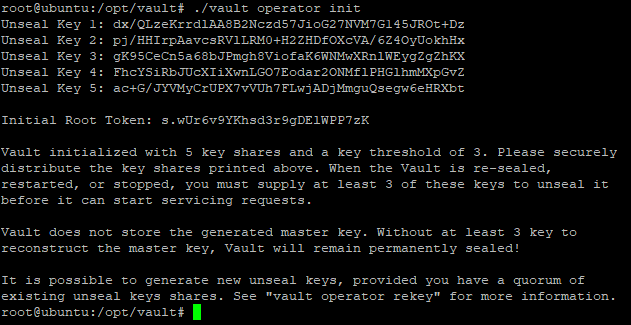

# **LAB STEPS**

This section walks through the necessary installation and configuration steps for HashiCorp Vault. The following steps start immediately after logging into the training platform.

## **Exercise #1 – Install Vault on the Ubuntu Server**

The most recent version of HashiCorp Vault (as of March 2020) has been downloaded to the /tmp directory of the Ubuntu server.

1. Connect to a Linux Server in your lab environment that will be the target for the Vault installation.

2. Change to the root user:

    ```bash
    sudo su
    ```

3. Create a directory for Vault and unpack the .zip file from the `/tmp` directory:

    ```bash
    mkdir /opt/vault
    ```

4. Unzip the pre-downloaded Vault installer to the newly created vault directory:

    ```bash
    unzip /tmp/vault_1.3.2_linux_amd64.zip -d /opt/vault/
    ```

5. Change to the `/opt/vault` directory and create another directory called `plugins`:

    ```bash
    cd /opt/vault

    mkdir plugins
    ```

6. Move up to the `/opt/vault` directory, then download and unzip the Venafi PKI backend plugin binary into the `/plugins` directory:

    ```bash
    wget https://github.com/Venafi/vault-pki-backend-venafi/releases/download/v0.5.3/venafi-pki-backend_v0.5.3+650_linux.zip

    unzip venafi-pki-backend_v0.5.3+650_linux.zip -d plugins/
    ```

7. Clean up the working directory by deleting the .zip file:

    ```bash
    rm venafi-pki-backend_v0.5.3+650_linux.zip
    ```

8. Create a Vault configuration file in the `/opt/vault` directory called ‘vault.hcl’ and add the following information:

    ```bash
    ui = true
    disable_mlock = true
    plugin_directory = “/opt/vault/plugins”
    api_addr = “http://localhost:8200”

    listener “tcp” {
    address = “0.0.0.0:8200”
    tls_disable = 1
    }

    backend “file” {
    path = “/opt/vault/secrets”
    }
    ```

    **NOTE: For simplicity this lab uses local file storage, but for a production use case a database backend like HashiCorp Consul would typically be used.**

9. Initialize Vault using the config file that was just created – this will run in the foreground of the current session:

    ```bash
    ./vault server -config=vault.hcl
    ```

10. Open a second session to the Vault server, change to the root user and move to the `/opt/vault` directory:

    ```bash
    sudo su

    cd /opt/vault
    ```

11. Set the VAULT_ADDR environment variable so that the Vault CLI knows where to find it:

    ```bash
    export VAULT_ADDR=http://127.0.0.1:8200
    ```

12. Verify connectivity by checking the Vault’s status:

    ```bash
    ./vault status
    ```

    

    **NOTE: Currently the vault has not been initialized, and has not yet been unsealed.**

13. Initialize Vault, which will output a list of 5 unseal keys and an initial root token – these values will be different for every environment, so be sure to copy them to a safe location for later use:

    ```bash
    ./vault operator init
    ```

    

    **NOTE: The unseal keys are fragments of a master key. This lab uses the default quorum of 3 of 5 which must be provided to Vault to unseal it. The total and number required for a quorum can be changed using the -key-shares and -key-threshold options.**

14. Execute the following command with 3 different unseal keys to unseal Vault – these values are provided for reference only and your environment will have different unseal keys and a different initial root token:

    ```bash
    ./vault operator unseal dx/QLzeKrrdlAA8B2Nczd57JioG27NVM7G145JROt+Dz

    ./vault operator unseal pj/HHIrpAavcsRVlLRM0+H2ZHDfOXcVA/6Z4OyUokhHx

    ./vault operator unseal gK95CeCn5a68bJPmgh8ViofaK6WNMwXRnlWEygZgZhKX
    ```

15. Set the VAULT_TOKEN environment variable to the initial root token value from step 13 so that the Vault CLI can authenticate – again, this value is provided as an example and the actual initial root token in your environment will be different.

    ```bash
    export VAULT_TOKEN= s.wUr6v9YKhsd3r9gDElWPP7zK
    ```

16. At this point, Vault is initialized and unsealed and the GUI can be viewed in a browser by visiting <http://vault_address:8200/ui.> The Vault external address can be found in the sidebar of the CloudShare lab environment, under Connection Details. Unfortunately, custom Secrets Engine plugins like the Vault PKI Backend and Vault PKI Monitor are currently not supported in the GUI, so the UI won’t be of use for the remainder of the lab, but it’s still a good idea to familiarize yourself with the available options.

 ---

## **Exercise #2 – Configure the Venafi PKI Backend Integration**

In the first exercise, the PKI Backend Plugin was downloaded and placed inside the /opt/vault/plugins directory. In exercise 2, we will configure the plugin and demonstrate some examples of the integration.

1. Login to WebAdmin.

2. Create a Policy folder called “Vault Requests” under the “Certificates” parent folder:

    

3. Ensure that “venafidemo.com” is the only whitelisted domain for this Policy:

    

4. Connect back into the Vault VM, either with SSH or using the CloudShare interface, and change to the /opt/vault directory:

    ```bash
    cd /opt/vault
    ```

5. Register the Venafi PKI backend plugin with Vault using the following commands – these commands will store the hash of the PKI Backend plugin to a variable, add the plugin to vault, and finally enable the plugin with the name of “venafi-pki-backend” at the Vault path “pki-venafi”:

    ```bash
    SHA256=$(shasum -a 256 $PWD/plugins/venafi-pki-backend | cut -d' ' -f1)

    ./vault write sys/plugins/catalog/venafi-pki-backend sha_256="${SHA256}" command="venafi-pki-backend"

    ./vault secrets enable -path=pki-venafi -description="Venafi backend for certificate enrollment" -plugin-name=venafi-pki-backend plugin
    ```

6. Next, initialize the plugin with the information it needs to connect and authenticate to the Venafi platform – This is done by creating a PKI role, called `tpp`, with the following options:

    ```bash
    ./vault write pki-venafi/roles/tpp generate_lease=true max_ttl=2160h tpp_url="https://tpp.venafidemo.com" zone="Certificates\\Vault Requests" tpp_user="local:tppadmin" tpp_password="Password123!"
    ```

7. Request a couple of certificates, which will allow Vault to generate the key pair and CSR:

    ```bash
    ./vault write pki-venafi/issue/tpp common_name="app1.venafidemo.com"

    ./vault write pki-venafi/issue/tpp common_name="app2.venafidemo.com"
    ```

8. Now, request a certificate that isn’t a part of the whitelisted domain – the request should fail because it doesn’t meet the specified policy:

    ```bash
    ./vault write pki-venafi/issue/tpp common_name="app3.example.com"
    ```

9. Log back into Web Admin and update the “Allowed Domains” to include example.com:

    

10. Try the same request from Step 8 again, and it should now complete successfully:

    ```bash
    ./vault write pki-venafi/issue/tpp common_name="app3.example.com"
    ```

---

## **Exercise #3 – Configure the Venafi PKI Monitor Integration**

The Venafi PKI Monitoring Secrets Engine for HashiCorp Vault enforces security policy set forth by the PKI/Security team and provides visibility to machine identities issued by Vault to the enterprise.

This allows HashiCorp Vault to issue certificates using Vault at the almost instantaneous speed that DevOps teams expect, while still providing the security teams the control and visibility they require.

1. You should already be in the /opt/vault directory from the previous step but, if not, change to that directory now, then download and unzip the Venafi PKI Monitor plugin binary into the ‘plugins’ directory

    ```bash
    cd /opt/vault

    wget https://github.com/Venafi/vault-pki-monitor-venafi/releases/download/v0.6.0/vault-pki-monitor-venafi_v0.6.0+496_linux86_strict.zip

    unzip vault-pki-monitor-venafi_v0.6.0+496_linux86_strict.zip -d plugins/
    ```

2. Clean up the working directory by deleting the .zip file

    ```bash
    rm vault-pki-monitor-venafi_v1.1.1+543_linux86_strict.zip
    ```

3. Log into Web Admin

    ```bash
    UN: tppadmin
    PW: Password123!
    ```

4. Create two new policy folders called “Vault Policy” and “Vault Issued” in the Certificates parent folder

    

5. Configure the Vault Policy folder with the following settings:
    - Organization set to “Venafi Inc.” **[LOCK POLICY]**
    - Country set to “US” **[LOCK POLICY]**
    - venafidemo.com set as a whitelisted domain

6. The Vault Issued folder will not have any defaults or locked policy values

7. Connect to the Ubuntu Server in your lab environment – For SSH access, the external address and OS credentials will be different for each user, but can be found in the CloudShare GUI left-hand navigation pane of the HashiCorp Vault tab:

    

8. Change to the root user

    ```bash
    sudo su
    ```

9. Switch to the `/opt/vault` directory

    ```bash
    cd /opt/vault
    ```

10. Register the Monitor plugin with Vault using the following commands - these commands will store the hash of the PKI Monitor plugin to a variable, add the plugin to vault, and finally enable the plugin with the name of `vault-pki-monitor-venafi_strict` at the Vault path `pki-local`

    ```bash
    SHA256=$(shasum -a 256 $PWD/plugins/vault-pki-monitor-venafi_strict | cut -d' ' -f1)

    ./vault write sys/plugins/catalog/vault-pki-monitor-venafi_strict sha_256="${SHA256}" command="vault-pki-monitor-venafi_strict"

    ./vault secrets enable -path=pki-local -description="Local CA with Venafi policy and visibility" -plugin-name=vault-pki-monitor-venafi_strict plugin
    ```

11. Increase the default TTL from 30 days (2,160 hours) to 90 days (8,750 hours)

    ```bash
    ./vault secrets tune -max-lease-ttl=8760h pki-local
    ```

12. Next, initialize the plugin with the information it needs to connect, authenticate and forward certificates to TPP for visibility. This is done by creating a PKI role, called `tpp`, with the following options:

    ```bash
    ./vault write pki-local/roles/tpp generate_lease=true ttl=2160h \
    max_ttl=8760h venafi_import=true store_by_cn=true store_pkey=true \
    store_by_serial=true tpp_url="https://tpp.venafidemo.com" \
    zone="Certificates\\Vault Issued" tpp_user="local:tppadmin" \
    tpp_password="Password123!" allowed_domains="venafidemo.com,example.com" \
    allow_subdomains=true organization="Venafi Inc."
    ```

13. The strict version of the Vault PKI Monitor plugin will not allow any certificate to be issued unless it complies with a Venafi policy, so we need to apply a Venafi Policy using the following command - this will target the `Certificates\Vault Policy` zone:

    ```bash
    ./vault write pki-local/venafi-policy/default tpp_url="https://tpp.venafidemo.com" zone="Certificates\\Vault Policy" tpp_user="local:tppadmin" tpp_password="Password123!"
    ```

14. Next, create a local Vault CA that will issued certificates:

    ```bash
    ./vault write pki-local/root/generate/internal ttl=8760h common_name="Vault PKI Test Root CA" organization="Venafi Inc." locality="Salt Lake City" province="Utah" country="US"
    ```

15. Finally, define the distribution point URLs for the CA:

    ```bash
    ./vault write pki-local/config/urls issuing_certificates="http://192.168.1.101:8200/v1/pki-local/ca" crl_distribution_points="http://192.168.1.101:8200/v1/pki-local/crl"
    ```

16. Now, try to request a certificate that complies with the role and Venafi policy configured earlier - the request should fail:

    ```bash
    ./vault write pki-local/issue/tpp common_name="app4.venafidemo.com"
    ```

17. The request fails because Vault gets most of the Subject DN from the Vault `role` and it currently does not include the *country* that is required by Venafi policy. Update the role with the following:

    ```bash
    ./vault write pki-local/roles/tpp generate_lease=true ttl=2160h \
    max_ttl=8760h _import=true store_by_cn=true store_pkey=true store_by_serial=true \
    tpp_url="https://tpp.venafidemo.com" zone="Certificates\\Vault Issued" \
    tpp_user="local:tppadmin" tpp_password="Password123!" \
    allowed_domains="venafidemo.com" allow_subdomains=true \
    organization="Venafi Inc." country="US"
    ```

18. Try the same request again and this time it should work:

    ```bash
    ./vault write pki-local/issue/tpp common_name="app4.venafidemo.com"
    ```

19. Log into the TPP Web Admin user interface and check the contents of the "Vault Issued" folder:

    

20. Now, let's test the impact of removing TPP connectivity to Vault - Temporarily stop the VEDWebSDK application pool on the TPP server:

    

21. Request a few more certificates from Vault:

    ```bash
    ./vault write pki-local/issue/tpp common_name="roland.venafidemo.com"

    ./vault write pki-local/issue/tpp common_name="eddie.venafidemo.com"

    ./vault write pki-local/issue/tpp common_name="susannah.venafidemo.com"

    ./vault write pki-local/issue/tpp common_name="jake.venafidemo.com"
    ```

    **NOTE: Certificates are still being issued, since Vault is the CA, but until the connection to the Venafi platform is restored, they won't make it back to TPP.**

22. Check the `Vault Issued` folder in Web Admin again and it should still only contain the first test certificate, `app4.venafidemo.com`

    

23. Execute the following command to view the forwarding queue:

    ```bash
    ./vault list pki-local/import-queue
    ```

    

24. Now, attempt to circumvent the applied Venafi policy by deleting it and creating a non-compliant certificate:

    ```bash
    ./vault delete pki-local/venafi-policy/default

    ./vault write pki-local/issue/tpp common_name="www.google.com"
    ```

    **NOTE: Since we are using the strict version of the plugin, a policy is required in order to issue certificates***

    

25. Re-apply the same policy from step 13:

    ```bash
    ./vault write pki-local/venafi-policy/default tpp_url="https://tpp.venafidemo.com" zone="Certificates\\Vault Policy" tpp_user="local:tppadmin" tpp_password="Password123!"
    ```

26. Restart the VEDWebSDK application pool on the TPP server and the monitor plugin should begin forwarding the certificates in the queue to the Venafi platform:

    

## **Exercise #4 – Limit Vault Access & Request Certificates Using the API**
